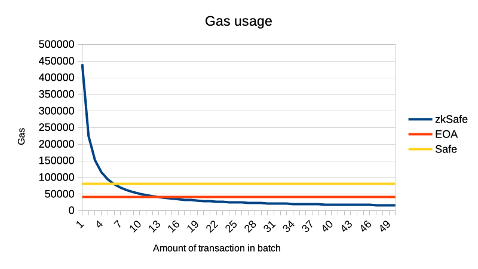

# zkSafe

## Aggregated Zero Knowledge Multisig on EVM blockchains

Using multisig in EVM blockchains, there is a trade-off between security (the number of signatures) and gas cost. The more signatures, the more expensive the transactions. If we introduce waiting time into this equation, there will be a trilemma - time, the number of signatures, and gas usage.

Thanks to the use of ZK technologies, it is possible to create batches of multisig transfers with a low transaction cost and a high number of signatures (with higher level of security). However, we will sacrifice waiting time.

# Gas efficiency

On a batch of 50 transactions our zkSafe contract will be 2.5 times cheaper than single signature EOA ERC20 transfer. Compared to the Gnosis Safe, our contract will be 5 times cheaper.

Using batch of 6 transactions our zkSafe contract become more efficient than Gnosis Safe. Using batch of 14 transactions our zkSafe contract become more efficient than EOA ERC20 transfer.



Data [source](/gas_usage/gas_usage.py) for this calculations and graph

# UX flow

User can deposit money to our contract using `deposit` method. He provide `multisig_id` - pedersen hash of `n`, `m` and `public_keys`. `m` - size of all participants, `n` - number of signatures required to execute transaction.

When user want to make a transaction, he sign `operation` message. `operation` message contain `amount`, `token` and `to` address. User send aggregated signature to operator.

Operator combine signatures from different users and generate zk proof. Operator send proof to contract calling method `execute`.

Operator can't steal money, because he can't create valid signature without private keys of participants. So protocol is secure and totally trustless.

# Technologies

## Zero knowledge

- [Circom](https://github.com/iden3/circom) - zk circuit language
- [Circomlib](https://github.com/iden3/circomlib) - zk circuits library
- [Pedersen hash](https://github.com/iden3/circomlib/blob/master/circuits/pedersen.circom) - hash function
- [EDDSA](https://github.com/iden3/circomlib/blob/master/circuits/eddsa.circom) - signature scheme
- [Groth16](https://eprint.iacr.org/2016/260.pdf) - zk proof system
- [SnarkJS](https://github.com/iden3/snarkjs) - zk proof system implementation

## Contracts

- [Foundry](https://github.com/foundry-rs/foundry) - EVM testing framework
- [OpenZeppelin](contracts/lib/openzeppelin-contracts) - ERC20 token

# GPT-3 joke

prompt:

*ChatGPT please write funny joke about Aggregated Zero Knowledge Multisig on EVM blockchains*

response:

*Why did the Aggregated Zero Knowledge Multisig contract become a stand-up comedian on the EVM blockchain?*

*Because it realized that even in the world of decentralized finance, a good laugh is the best way to cope with those gas fees that just keep multiplying! 😄💸*

# Circuit

## SingleMultisig Template:

This is a template that defines the logic for a single multi-signature. It takes several inputs such as n and m (presumably the number and threshold of signatures required), valid_signature (binary array of signature validity), msg (the message being signed), A (public keys), public_key_hash (the aggregated public key), R8 and S (components of the signature).

The template calculates the aggregated public key hash using the Pedersen commitment scheme and ensures that it matches the provided public_key_hash.

It also checks the validity of individual signatures depending on the value of valid_signature. If valid_signature is 1, the template checks that the signature is valid. If valid_signature is 0, the template checks that the signature is invalid.

## packMessageToBits Template

This template is responsible for converting the messages into binary representations. It takes as input a serialized message (msg) and converts it into msg_bits using a component called Num2Bits. 

## AggregatedMultisig Template: 

This template is the core of the circuit. It takes a set of parameters and arranges them into an aggregated multi-signature. It's pack message to bits component and verify single multi-signature.

The amount of signature we verify depends on amount_to_prove parameter

## Building

Build circom:

```
cd /tmp
git clone https://github.com/iden3/circom.git
cargo build --release
cargo install --path circom
```

Install dependencies for circuit:


```
cd circuits
npm install
```

Build circuit:

```
circom multisig.circom --r1cs --wasm --sym --c
```

# Trusted setup

```
cd prover
npm install
```

First, we start a new "powers of tau" trusted setup ceremony, size: 2**20

```
snarkjs powersoftau new bn128 20 pot20_0000.ptau -v
```

First contribution to the ceremony

```
snarkjs powersoftau contribute pot20_0000.ptau pot20_0001.ptau --name="First contribution" -v
```

Prepare circuit specific phase2. Finalize the ceremony

```
snarkjs powersoftau prepare phase2 pot20_0001.ptau pot20_final.ptau -v
```

Export verification key

```
snarkjs groth16 setup ../circuits/src/multisig.r1cs pot20_final.ptau multisig.zkey
```

Generate solidity verifier

```
snarkjs zkey export solidityverifier multisig.zkey ../contracts/src/Verifier.sol
```


# ZkSafe Smart Contract

`ZkSafe` is a smart contract designed for Ethereum that enhances ERC20 transfer optimization through zero-knowledge proofs. This contract facilitates the management of multisig wallets, enabling operations to be conducted.

- **Deposit Funds**: Users can deposit ERC20 tokens into multisig wallets, using a unique `multisig_id` for identification.
- **Execute Transactions with zkProofs**: The contract allows the execution of batch of transfers, contingent upon the provision of valid zero-knowledge proofs
- **Pack Operation Data**: It includes a utility to pack transaction data into a consistent format, necessary for zero-knowledge proof generation.

`Groth16Verifier` is an integral part of the ZkSafe system, responsible for the verification of zero-knowledge proofs. It is generated after a trusted setup phase, which is a one-off event that produces the necessary cryptographic parameters for generating and verifying proofs. The verifier ensures that ZkSafe can validate transactions without disclosure of the actual data, maintaining the privacy of the participants.

To get started with ZkSafe, follow these steps:

### Installation
This will install the necessary dependencies including Foundry for contract compilation and testing

```shell
make install
```

### Building
Compile the contract with the following command
```shell
make build
```

### Testing
Before deploying, run the tests to ensure everything is functioning as expected. Testing the contract not only ensures correctness but also allows for the evaluation of gas consumption for various ERC20 transfer approaches. It is recommended to run comprehensive tests to validate the contract's behavior and performance. Keep in mind it's necessary to have generated `Groth16Verifier` contract

```shell
make test
```

### Deployment
Make sure to set your `RPC_URL` and `PRIVATE_KEY` in an .env file before deployment.

Deploy ZkSafe using
```shell
make deploy
```


We encourage contributions to the project. When contributing, please write tests for new functionalities and ensure they pass before creating a pull request.


# Off-chain Wallet

The `ZkSafe` project includes an off-chain wallet component located in the `wallet` folder. This component is instrumental for securely generating transactions with transfers and signing them with a multisig scheme. The off-chain wallet also serves as the witness generator for the Circom circuit, which is vital for enabling the zero-knowledge proof feature of `ZkSafe`.

The wallet's functionality is encapsulated in two main scripts within the `wallet` folder:


- `generateKeys.js`: For key pair generation.
- `sign.js`: For signing transactions.

To interact with the off-chain wallet for generating transactions and multisig signatures, you need to ensure that all dependencies are installed.

Navigate to the `wallet` directory and run one of the following commands, depending on your package manager of choice:

Using npm:
```shell
cd wallet
npm install
```

### Key Generation

Located in the `wallet` folder, the `generateKeys.js` script is used to generate private and public key pairs for the multisig wallet. These keys are essential for creating a secure and functional multisig wallet within the `ZkSafe` ecosystem.

**Script Path**: `wallet/generateKeys.js`

Usage

```shell
node wallet/generateKeys.js [amount]
```
`amount` is an optional parameter that determines the number of key pairs to generate


### Transaction Signing

The sign.js script in the wallet folder mimics the signing process of a multisig wallet, packing transaction details into the expected format for the zk-SNARKs circuit and signing the transaction accordingly.

**Script Path**: `wallet/sign.js`

Usage

```shell
node wallet/sign.js
```

By running this script, users can simulate the signing of transactions, verifying signatures, and preparing inputs for zk-SNARK proofs. The script also writes the necessary data to an `index.json` file, which contains all the information needed for the circuit to prove a valid multisig transaction.

The wallet directory contains the necessary tools for secure transaction signing and key management in a privacy-preserving manner, both of which are integral to the operation of ZkSafe.